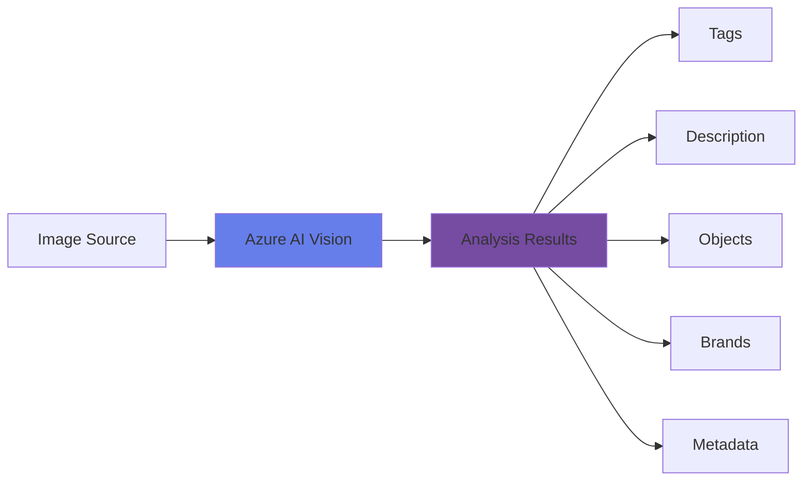

# Analyze Images


<div class="hero-container">
  
</div>

## Overview

Image analysis is the foundation of computer vision. Azure AI Vision provides powerful capabilities to analyze images and extract valuable information including tags, descriptions, objects, brands, faces, and more.

As shown in the above conceptual diagram, the Azure Vision service provides services that you can use to analyze images and:

- Generate a caption for an image based on its contents.
- Suggest appropriate tags to associate with an image.
- Detect and locate common objects in an image.
- Detect and locate people in an image.

## Topic Notes

### What is Image Analysis?

Image analysis involves using artificial intelligence to automatically identify and categorize elements within an image. Azure AI Vision uses state-of-the-art machine learning models to understand image content and provide structured data about what's in the image.

### Key Capabilities

#### 1. **Visual Features Extraction**

Azure AI Vision can extract multiple visual features from images:

- **Tags**: Identify objects, living beings, scenery, and actions
- **Categories**: Classify images into predefined categories
- **Description**: Generate human-readable descriptions
- **Colors**: Detect dominant and accent colors
- **Image Type**: Identify if image is clip art or line drawing

```python
from azure.cognitiveservices.vision.computervision import ComputerVisionClient
from msrest.authentication import CognitiveServicesCredentials

# Initialize the client
credentials = CognitiveServicesCredentials(subscription_key)
client = ComputerVisionClient(endpoint, credentials)

# Analyze an image
image_url = "https://example.com/image.jpg"
features = ["tags", "description", "categories", "color"]
results = client.analyze_image(image_url, visual_features=features)

# Access results
print(f"Description: {results.description.captions[0].text}")
print(f"Tags: {[tag.name for tag in results.tags]}")
```

#### 2. **Object Detection**

Detect and locate objects within images with bounding boxes:

- Identify multiple objects in a single image
- Get confidence scores for each detection
- Retrieve bounding box coordinates

#### 3. **Brand Detection**

Automatically recognize commercial brands and logos:

- Detect over 2000+ global brands
- Get brand name and confidence level
- Locate brand position in the image

#### 4. **Adult Content Detection**

Classify images for adult, racy, or gory content:

- **Adult**: Sexually explicit content
- **Racy**: Sexually suggestive content
- **Gory**: Violence and blood

### Best Practices

!!! tip "Image Quality"
    - Use high-resolution images (recommended: at least 50x50 pixels)
    - Ensure good lighting and minimal blur
    - Supported formats: JPEG, PNG, GIF, BMP

!!! warning "API Limits"
    - Image size: Maximum 4 MB
    - Dimensions: Between 50x50 and 16000x16000 pixels
    - Rate limits apply based on your pricing tier

### Common Use Cases

1. **E-commerce**: Automatically tag and categorize product images
2. **Content Moderation**: Filter inappropriate content
3. **Digital Asset Management**: Organize large image libraries
4. **Accessibility**: Generate descriptions for visually impaired users
5. **Social Media**: Auto-tag photos and enhance search

### Architecture Pattern



<div class="practice-questions">

### 🎯 Practice Questions

1. **What are the minimum and maximum image dimensions supported by Azure AI Vision?**
   
   <details>
   <summary>Show Answer</summary>
   Minimum: 50x50 pixels, Maximum: 16000x16000 pixels
   </details>

2. **Name three types of visual features you can extract from an image using Azure AI Vision.**
   
   <details>
   <summary>Show Answer</summary>
   Tags, descriptions, categories, colors, objects, brands, faces, adult content classification, image type
   </details>

3. **What is the maximum file size for an image that can be analyzed by Azure AI Vision?**
   
   <details>
   <summary>Show Answer</summary>
   4 MB (megabytes)
   </details>

4. **How does brand detection work in Azure AI Vision, and approximately how many brands can it recognize?**
   
   <details>
   <summary>Show Answer</summary>
   Brand detection automatically recognizes commercial brands and logos in images, and can detect over 2000+ global brands with confidence scores and bounding boxes.
   </details>

5. **What are the three content moderation categories that Azure AI Vision can detect?**
   
   <details>
   <summary>Show Answer</summary>
   Adult (sexually explicit), Racy (sexually suggestive), and Gory (violence/blood) content
   </details>

6. **Why is it important to use high-quality images for analysis?**
   
   <details>
   <summary>Show Answer</summary>
   High-quality images with good resolution, lighting, and minimal blur provide more accurate analysis results and better confidence scores for detected features.
   </details>

</div>

### Hands-On Exercise

Try this exercise to reinforce your learning:

!!! example "Exercise: Analyze Your First Image"
    1. Create an Azure AI Vision resource in the Azure Portal
    2. Get your subscription key and endpoint
    3. Use the Azure AI Vision SDK or REST API to analyze an image
    4. Extract tags, description, and colors
    5. Display the results in a formatted output

## 📚 Resources

- [Azure AI Vision Documentation](https://learn.microsoft.com/en-us/azure/ai-services/computer-vision/)
- [Analyze Images Quickstart](https://learn.microsoft.com/en-us/azure/ai-services/computer-vision/quickstarts-sdk/image-analysis-client-library)
- [Image Analysis API Reference](https://learn.microsoft.com/en-us/rest/api/computervision/analyze-image)
- [Azure AI Vision Pricing](https://azure.microsoft.com/en-us/pricing/details/cognitive-services/computer-vision/)
- [Python SDK Documentation](https://learn.microsoft.com/en-us/python/api/azure-cognitiveservices-vision-computervision/)
- [Best Practices Guide](https://learn.microsoft.com/en-us/azure/ai-services/computer-vision/how-to/image-retrieval)
- [Analyze Images Applied Skills](https://learn.microsoft.com/en-us/training/modules/analyze-images/)

---

[Next: Read Text in Images →](read-text-in-images.md)
