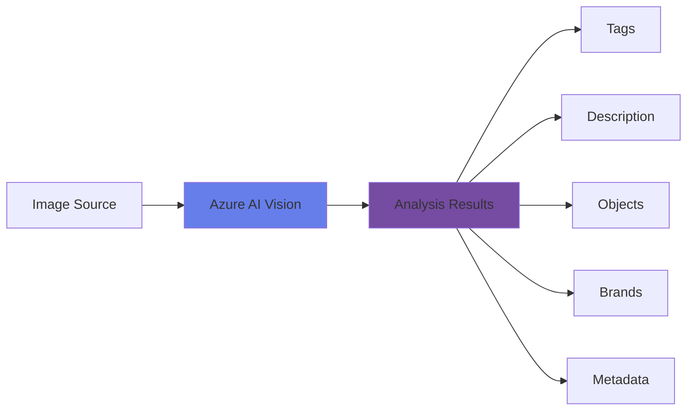

# Analyze Images


<div class="hero-container">
  
</div>

## Overview

Image analysis is the foundation of computer vision. Azure AI Vision provides powerful capabilities to analyze images and extract valuable information including tags, descriptions, objects, brands, faces, and more.

As shown in the above conceptual diagram, the Azure Vision service provides services that you can use to analyze images and:

- Generate a caption for an image based on its contents.
- Suggest appropriate tags to associate with an image.
- Detect and locate common objects in an image.
- Detect and locate people in an image.

## Topic Notes

### What is Image Analysis?

Image analysis is like turning a computer into a detective or art critic! 🕵️‍♂️🖼️ Imagine uploading a photo and asking your computer, "Hey, what’s happening here?" With image analysis, the computer looks at all the tiny dots (pixels), spots patterns, colors, and shapes, and tries to figure out things like:

Who or what is in the picture? (Is that a dog? Is that my salad or my homework?)
What are they doing? (Is the cat jumping, sleeping, or plotting world domination?)

Are there any hidden clues? (Detecting objects, reading text in an image, or recognizing a friend’s smiling face)

Fun facts on how it works:

Computers don’t really "see"—they use cool math and algorithms to recognize patterns, much like how you can spot your favorite pizza slice from across the room!

Techniques range from simple (how bright or colorful an area is) to super advanced (using AI to guess what’s in a photo, even if it’s messy or weird).
Even your smartphone uses image analysis all the time—for face unlock, blurring backgrounds, counting steps (when you take a selfie on a hike), or translating menus on vacation.

In short:
Image analysis is the science (and art!) of teaching computers to look at pictures and find useful, surprising, or hilarious things… and sometimes even to make recommendations, like, "Would you like to see more pictures of puppies?"

### Key Capabilities

#### 1. **Visual Features Extraction**

Azure AI Vision can extract multiple visual features from images:

- **Tags**: Identify objects, living beings, scenery, and actions
- **Categories**: Classify images into predefined categories
- **Description**: Generate human-readable descriptions
- **Colors**: Detect dominant and accent colors
- **Image Type**: Identify if image is clip art or line drawing

```python
from azure.cognitiveservices.vision.computervision import ComputerVisionClient
from msrest.authentication import CognitiveServicesCredentials

# Initialize the client
credentials = CognitiveServicesCredentials(subscription_key)
client = ComputerVisionClient(endpoint, credentials)

# Analyze an image
image_url = "https://example.com/image.jpg"
features = ["tags", "description", "categories", "color"]
results = client.analyze_image(image_url, visual_features=features)

# Access results
print(f"Description: {results.description.captions[0].text}")
print(f"Tags: {[tag.name for tag in results.tags]}")
```

#### 2. **Object Detection**

Detect and locate objects within images with bounding boxes:

- Identify multiple objects in a single image
- Get confidence scores for each detection
- Retrieve bounding box coordinates

#### 3. **Brand Detection**

Automatically recognize commercial brands and logos:

- Detect over 2000+ global brands
- Get brand name and confidence level
- Locate brand position in the image

#### 4. **Adult Content Detection**

Classify images for adult, racy, or gory content:

- **Adult**: Sexually explicit content
- **Racy**: Sexually suggestive content
- **Gory**: Violence and blood

### Best Practices

!!! tip "Image Quality"
    - Use high-resolution images (recommended: at least 50x50 pixels)
    - Ensure good lighting and minimal blur
    - Supported formats: JPEG, PNG, GIF, BMP

!!! warning "API Limits"
    - Image size: Maximum 4 MB
    - Dimensions: Between 50x50 and 16000x16000 pixels
    - Rate limits apply based on your pricing tier

### Common Use Cases

1. **E-commerce**: Automatically tag and categorize product images
2. **Content Moderation**: Filter inappropriate content
3. **Digital Asset Management**: Organize large image libraries
4. **Accessibility**: Generate descriptions for visually impaired users
5. **Social Media**: Auto-tag photos and enhance search

### Architecture Pattern



<div class="practice-questions">

### 🎯 Practice Questions

1. Spot the Scene!

You’ve just arrived in a new city. Using image analysis, your phone shows “historic building” and “bicycle” as tags. What’s the likely scene, and how might the app decide which tags to suggest?

2. What’s Hiding in the Text?

Snap a photo of a coffee shop menu. How can OCR (Optical Character Recognition) in the Computer Vision service help you find out where the cappuccinos are listed? Write a simple sentence that Python could use to extract the word “Cappuccino” from the image.

3. Emojis and Object Detection!

Imagine a program that analyzes your uploaded photo and adds emojis automatically—🍕 for pizza, 🐶 for dogs, etc. What kinds of features in an image would the software need to look for to assign these emojis correctly?

4. Describe It Like You’re an AI

Look at a random picture around you (or find one online). Quickly describe it in just one or two sentences—as if you’re the Computer Vision service. For example: “A brown dog is running on green grass.” What kinds of image features might help an AI generate your description?

5. Guess the Age of a Meme

Some memes are instantly recognizable, but how could an image analysis system guess how old a meme template is? What image properties (color, style, text type) might it analyze?

6. Translating Text with Vision

Let’s say you’re traveling in Japan and use your phone to analyze a street sign’s image for translation. What challenges might the image analyzer face, and how could you improve its accuracy?

7. Filter Fiasco: What’s the Impact?

If you slap a photo filter (like grayscale or heavy blur) on an image before analyzing it, what kinds of things might get harder for a computer to recognize? Why?

8. Building Your Own Labeler

Pretend you’re training a robot to recognize different kinds of fruit. What’s one super-important feature you’d tell the robot to look at when sorting apples from oranges, using image analysis?

9. Find the Odd One Out

You analyze a group photo and get tags: “Person,” “Smiling,” “Cat,” “Outdoors.” Which tag seems a little surprising, and how might the AI have spotted it?

10. Fun With Bounding Boxes!

In object detection, why do computers use rectangles or boxes around things they spot? Bonus: Sketch a simple scene and imagine where the boxes would go!

</div>

### Hands-On Exercise

Try this exercise to reinforce your learning:

!!! example "Exercise: Analyze Your First Image"
    1. Create an Azure AI Vision resource in the Azure Portal
    2. Get your subscription key and endpoint
    3. Use the Azure AI Vision SDK or REST API to analyze an image
    4. Extract tags, description, and colors
    5. Display the results in a formatted output

[Hands-on Lab](https://microsoftlearning.github.io/mslearn-ai-vision/Instructions/Labs/01-analyze-images.html)


## 📚 Resources

- [Azure AI Vision Documentation](https://learn.microsoft.com/en-us/azure/ai-services/computer-vision/)
- [Analyze Images Quickstart](https://learn.microsoft.com/en-us/azure/ai-services/computer-vision/quickstarts-sdk/image-analysis-client-library)
- [Image Analysis API Reference](https://learn.microsoft.com/en-us/rest/api/computervision/analyze-image)
- [Analyze Images Applied Skills](https://learn.microsoft.com/en-us/training/modules/analyze-images/)

---

[Next: Read Text in Images →](read-text-in-images.md)
