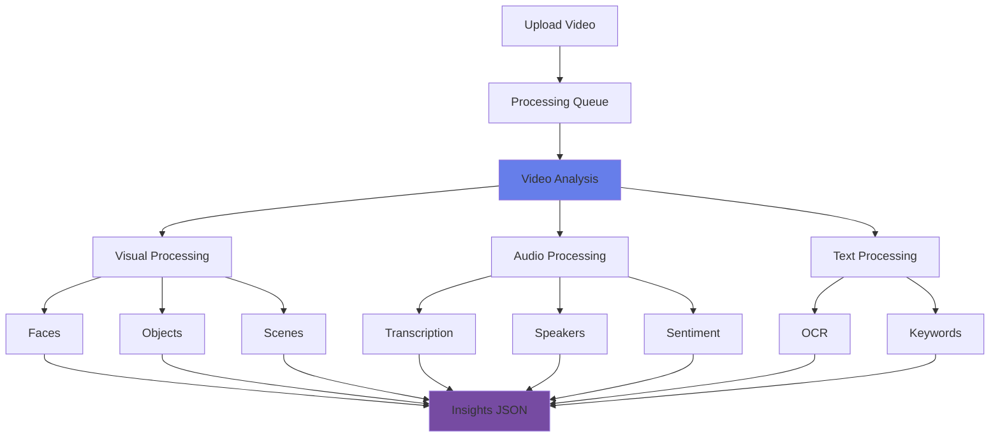

# Analyze Video

<div class="hero-section">
  <div class="hero-overlay">
    <div class="hero-content">
      <h1>Analyze Video</h1>
      <p>Process and extract insights from video content using Azure Video Indexer</p>
    </div>
  </div>
</div>

## Overview

Video analysis extends computer vision capabilities to moving images, enabling extraction of insights, metadata, and actionable information from video content. Azure Video Indexer provides comprehensive video analysis capabilities powered by AI.

## Topic Notes

### What is Video Analysis?

Video analysis involves processing video content to extract information such as faces, text, objects, scenes, emotions, and audio transcription. It's essentially applying computer vision and audio analysis frame-by-frame across video content.

### Key Capabilities

#### 1. **Azure Video Indexer**

A comprehensive video analysis service that provides:

- **Visual analysis**: Face detection, OCR, object detection, scene segmentation
- **Audio analysis**: Speech-to-text, speaker identification, sentiment analysis
- **Content moderation**: Detect inappropriate content
- **Insights extraction**: Keywords, topics, brands, named entities

```python
# Using Azure Video Indexer API
import requests
import json

# Upload video
def upload_video(video_url, video_name, account_id, location, access_token):
    upload_url = f"https://api.videoindexer.ai/{location}/Accounts/{account_id}/Videos"
    
    params = {
        'name': video_name,
        'videoUrl': video_url,
        'accessToken': access_token,
        'privacy': 'Private'
    }
    
    response = requests.post(upload_url, params=params)
    video_id = response.json()['id']
    return video_id

# Get video insights
def get_insights(video_id, account_id, location, access_token):
    insights_url = f"https://api.videoindexer.ai/{location}/Accounts/{account_id}/Videos/{video_id}/Index"
    
    params = {
        'accessToken': access_token
    }
    
    response = requests.get(insights_url, params=params)
    return response.json()
```

#### 2. **Video Analysis Features**

##### Visual Features
- **Face detection and tracking**: Identify and track faces across frames
- **Celebrity recognition**: Identify famous people
- **OCR**: Extract text appearing in videos
- **Scene detection**: Segment video into scenes
- **Keyframe extraction**: Identify representative frames
- **Object tracking**: Track objects through the video
- **Brand detection**: Identify logos and brands

##### Audio Features
- **Transcription**: Speech-to-text with timestamps
- **Speaker identification**: Distinguish between speakers
- **Language detection**: Identify spoken language
- **Audio effects**: Detect applause, silence, crowd noise
- **Sentiment analysis**: Analyze emotional tone

##### Content Understanding
- **Topics and keywords**: Extract main themes
- **Named entities**: Identify people, locations, organizations
- **Emotions**: Detect emotions in faces and voice
- **Labels**: Automatic tagging of content

### Video Processing Workflow



### Best Practices

!!! tip "Video Quality Guidelines"
    - **Resolution**: Minimum 360p, recommended 720p or higher
    - **Format**: MP4, MOV, AVI, WMV, FLV, MKV
    - **Duration**: No strict limit, but longer videos take more time
    - **Audio**: Clear audio for better transcription
    - **Lighting**: Good lighting for better face/object detection

!!! warning "Processing Considerations"
    - Processing time varies with video length and complexity
    - Longer videos consume more processing resources
    - Check rate limits for your subscription tier
    - Store videos in accessible locations (URLs or Azure Storage)

### Use Cases

1. **Content Monetization**: Tag and categorize video libraries
2. **Accessibility**: Generate closed captions and transcripts
3. **Content Moderation**: Automatically detect inappropriate content
4. **Media & Entertainment**: Index large video archives
5. **Education**: Create searchable lecture libraries
6. **Surveillance**: Analyze security camera footage
7. **Sports Analytics**: Track players and game events
8. **Marketing**: Analyze brand mentions in videos

### Advanced Features

#### Custom Models

Train custom models for:
- **Person identification**: Recognize specific people
- **Language models**: Improve transcription for domain terms
- **Brand detection**: Add custom brands and logos

```python
# Create custom person model
def create_person_model(account_id, location, access_token, model_name):
    url = f"https://api.videoindexer.ai/{location}/Accounts/{account_id}/Customization/PersonModels"
    
    params = {
        'name': model_name,
        'accessToken': access_token
    }
    
    response = requests.post(url, params=params)
    return response.json()
```

#### Widgets and Embeds

Video Indexer provides embeddable widgets:
- **Insights widget**: Display extracted insights
- **Player widget**: Video player with interactive timeline
- **Editor widget**: Edit and annotate videos

#### Timeline Features

All insights are timestamped:
- Jump to specific moments
- Search within video content
- Create clips based on insights
- Generate highlights automatically

<div class="practice-questions">

### 🎯 Practice Questions

1. **What are the three main types of analysis provided by Azure Video Indexer?**
   
   <details>
   <summary>Show Answer</summary>
   Visual analysis (faces, objects, scenes, OCR), Audio analysis (transcription, speakers, sentiment), and Content understanding (topics, keywords, named entities).
   </details>

2. **What video formats does Azure Video Indexer support?**
   
   <details>
   <summary>Show Answer</summary>
   MP4, MOV, AVI, WMV, FLV, MKV, and other common video formats.
   </details>

3. **What is the minimum recommended video resolution for good analysis results?**
   
   <details>
   <summary>Show Answer</summary>
   Minimum 360p, with 720p or higher recommended for best results.
   </details>

4. **Name three audio features that Video Indexer can extract.**
   
   <details>
   <summary>Show Answer</summary>
   Speech-to-text transcription, speaker identification, language detection, audio effects detection, and sentiment analysis.
   </details>

5. **What are the three embeddable widgets provided by Video Indexer?**
   
   <details>
   <summary>Show Answer</summary>
   Insights widget (display extracted insights), Player widget (video player with timeline), and Editor widget (edit and annotate videos).
   </details>

6. **What types of custom models can you train in Video Indexer?**
   
   <details>
   <summary>Show Answer</summary>
   Person identification models, language models (for domain-specific transcription), and brand detection models (for custom brands/logos).
   </details>

7. **Why is timestamp information important in video analysis?**
   
   <details>
   <summary>Show Answer</summary>
   Timestamps allow users to jump to specific moments, search within video content, create clips based on insights, and navigate large videos efficiently.
   </details>

</div>

### Hands-On Exercise

!!! example "Exercise: Analyze a Video"
    1. Create an Azure Video Indexer account
    2. Upload a sample video (or use a URL)
    3. Wait for processing to complete
    4. Explore the insights:
        - View detected faces and objects
        - Read the transcript
        - Check keywords and topics
        - Review timeline annotations
    5. Try the search functionality
    6. Embed the player widget in a web page

### Performance Optimization

- **Preprocessing**: Clean audio for better transcription
- **Metadata**: Provide accurate video metadata
- **Batch processing**: Process multiple videos efficiently
- **Storage**: Use Azure Storage for large video libraries
- **Caching**: Cache insights for frequently accessed videos

### Privacy and Compliance

!!! info "Data Privacy"
    - Control video privacy settings (Private, Public, Unlisted)
    - Manage access with account-level permissions
    - Comply with GDPR and data regulations
    - Use face redaction for sensitive content
    - Control data retention policies

<div class="resources-section">

## 📚 Resources

- [Azure Video Indexer Documentation](https://learn.microsoft.com/en-us/azure/azure-video-indexer/)
- [Video Indexer API Reference](https://learn.microsoft.com/en-us/rest/api/videoindexer/)
- [Quickstart Guide](https://learn.microsoft.com/en-us/azure/azure-video-indexer/video-indexer-get-started)
- [Custom Models Documentation](https://learn.microsoft.com/en-us/azure/azure-video-indexer/customize-person-model-overview)
- [Embed Widgets Guide](https://learn.microsoft.com/en-us/azure/azure-video-indexer/video-indexer-embed-widgets)
- [Video Indexer Pricing](https://azure.microsoft.com/en-us/pricing/details/video-indexer/)

</div>

---

[← Previous: Detect Objects in Images](detect-objects-in-images.md) | [Next: Develop a Vision-Enabled Gen AI App →](vision-enabled-gen-ai-app.md)
