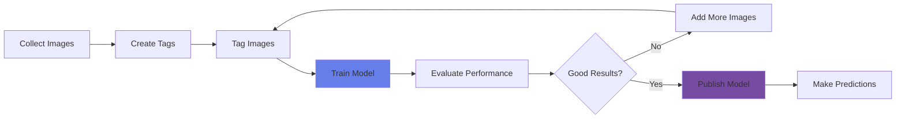

# Classify Images

<div class="hero-container">
  
</div>

## Overview

Image classification is the task of categorizing images into predefined classes or labels. Azure Custom Vision enables you to build, train, and deploy custom image classification models without requiring deep machine learning expertise.

## Topic Notes

### What is Image Classification?

Image classification assigns one or more labels to an entire image based on its content. Unlike object detection (which locates objects), classification identifies what an image represents as a whole.

### Key Capabilities

#### 1. **Azure Custom Vision**

Custom Vision provides two main project types:

##### Classification Types
- **Multiclass**: Each image has a single label (e.g., cat OR dog)
- **Multilabel**: Each image can have multiple labels (e.g., sunny AND beach AND ocean)

```python
from azure.cognitiveservices.vision.customvision.training import CustomVisionTrainingClient
from azure.cognitiveservices.vision.customvision.prediction import CustomVisionPredictionClient
from msrest.authentication import ApiKeyCredentials

# Initialize training client
credentials = ApiKeyCredentials(in_headers={"Training-key": training_key})
trainer = CustomVisionTrainingClient(training_endpoint, credentials)

# Create a project
project = trainer.create_project(
    name="Product Classifier",
    classification_type="Multiclass"
)

# Create tags
electronics_tag = trainer.create_tag(project.id, "Electronics")
clothing_tag = trainer.create_tag(project.id, "Clothing")
food_tag = trainer.create_tag(project.id, "Food")
```

#### 2. **Model Training Process**



#### 3. **Training Your Model**

##### Data Preparation
- **Minimum images**: 5 per tag (recommended: 50+)
- **Variety**: Include diverse angles, lighting, backgrounds
- **Balance**: Similar number of images per class
- **Quality**: Clear, well-lit, properly framed images

##### Training Process
```python
# Upload and tag images
with open("image1.jpg", "rb") as image_file:
    trainer.create_images_from_files(
        project.id,
        images=[
            ImageFileCreateEntry(
                name="image1.jpg",
                contents=image_file.read(),
                tag_ids=[electronics_tag.id]
            )
        ]
    )

# Train the model
iteration = trainer.train_project(project.id)

# Wait for training to complete
while iteration.status != "Completed":
    iteration = trainer.get_iteration(project.id, iteration.id)
    time.sleep(1)

# Publish the iteration
trainer.publish_iteration(
    project.id,
    iteration.id,
    "production",
    prediction_resource_id
)
```

#### 4. **Making Predictions**

```python
# Initialize prediction client
prediction_credentials = ApiKeyCredentials(in_headers={"Prediction-key": prediction_key})
predictor = CustomVisionPredictionClient(prediction_endpoint, prediction_credentials)

# Classify an image
with open("test_image.jpg", "rb") as image_file:
    results = predictor.classify_image(
        project.id,
        "production",
        image_file.read()
    )

# Display results
for prediction in results.predictions:
    print(f"{prediction.tag_name}: {prediction.probability:.2%}")
```

### Model Performance Metrics

#### Key Metrics

- **Precision**: Of all predictions for a tag, how many were correct?
- **Recall**: Of all actual instances of a tag, how many were detected?
- **AP (Average Precision)**: Overall accuracy measure

!!! info "Performance Thresholds"
    - **Precision**: Probability threshold above which a prediction is positive
    - **Recall**: Probability threshold that catches all instances
    - Default threshold: 50%, but can be adjusted based on use case

### Best Practices

!!! tip "Data Collection"
    - **Quality over quantity**: Better to have diverse, high-quality images
    - **Real-world variations**: Include different angles, lighting, backgrounds
    - **Edge cases**: Include challenging examples
    - **Negative examples**: Optional negative tag for images that don't fit any category

!!! warning "Common Pitfalls"
    - **Overfitting**: Too many similar images
    - **Imbalanced data**: Unequal distribution of images per tag
    - **Poor image quality**: Blurry or poorly lit images
    - **Inconsistent tagging**: Mislabeled training data

### Use Cases

1. **Product Categorization**: Automatically classify e-commerce products
2. **Quality Control**: Identify defective vs. non-defective items
3. **Medical Imaging**: Classify medical scans (with proper validation)
4. **Agriculture**: Identify plant diseases or crop types
5. **Wildlife Monitoring**: Classify animal species in camera trap images
6. **Document Classification**: Categorize documents by type

### Advanced Features

#### Domain-Specific Models

Custom Vision provides pre-optimized domains:

- **General**: Default for most scenarios
- **Food**: Optimized for food and meal images
- **Landmarks**: Famous buildings and landmarks
- **Retail**: Products and merchandise
- **Compact domains**: Smaller models for edge deployment (iOS, Android, Windows)

```python
# Create project with specific domain
domains = trainer.get_domains()
food_domain = next(d for d in domains if d.name == "Food")

project = trainer.create_project(
    name="Food Classifier",
    domain_id=food_domain.id
)
```

#### Export Options

Export trained models for offline use:
- TensorFlow
- CoreML (iOS)
- ONNX (Windows ML)
- Dockerfile

<div class="practice-questions">

### 🎯 Practice Questions

1. **What is the difference between multiclass and multilabel classification?**
   
   <details>
   <summary>Show Answer</summary>
   Multiclass classification assigns a single label to each image (e.g., cat OR dog), while multilabel classification can assign multiple labels to the same image (e.g., sunny AND beach AND ocean).
   </details>

2. **What is the minimum number of images required per tag in Azure Custom Vision?**
   
   <details>
   <summary>Show Answer</summary>
   5 images per tag minimum, but 50+ images per tag is recommended for better accuracy.
   </details>

3. **What are the three key performance metrics for evaluating a classification model?**
   
   <details>
   <summary>Show Answer</summary>
   Precision (correctness of positive predictions), Recall (coverage of actual positives), and AP/Average Precision (overall accuracy measure).
   </details>

4. **Why is it important to have balanced data across different tags?**
   
   <details>
   <summary>Show Answer</summary>
   Balanced data ensures the model learns all classes equally well. Imbalanced data can cause the model to be biased toward the majority class and perform poorly on minority classes.
   </details>

5. **What are compact domains in Custom Vision, and when would you use them?**
   
   <details>
   <summary>Show Answer</summary>
   Compact domains are smaller, optimized models that can be exported and run on edge devices (iOS, Android, Windows). They trade some accuracy for smaller size and faster inference on mobile/edge devices.
   </details>

6. **Name three domain-specific models available in Azure Custom Vision.**
   
   <details>
   <summary>Show Answer</summary>
   General, Food, Landmarks, Retail, and compact domains for various categories.
   </details>

7. **What export formats does Custom Vision support for offline model deployment?**
   
   <details>
   <summary>Show Answer</summary>
   TensorFlow, CoreML (iOS), ONNX (Windows ML), and Dockerfile.
   </details>

</div>

### Hands-On Exercise

!!! example "Exercise: Build an Image Classifier"
    1. Create a Custom Vision project in Azure Portal
    2. Choose between multiclass or multilabel classification
    3. Create at least 3 tags (categories)
    4. Upload and tag at least 15-30 images (5-10 per tag)
    5. Train the model
    6. Test the model with new images
    7. Analyze precision and recall metrics
    8. Iterate: add more images where performance is weak

### Optimization Tips

- **Start small**: Begin with 2-3 classes
- **Iterate quickly**: Train early, evaluate, add data
- **Use Smart Labeler**: After initial training, use suggestions
- **Monitor performance**: Track precision/recall over iterations
- **Version models**: Keep previous iterations as backups

<div class="resources-section">

## 📚 Resources

- [Azure Custom Vision Documentation](https://learn.microsoft.com/en-us/azure/ai-services/custom-vision-service/)
- [Image Classification Quickstart](https://learn.microsoft.com/en-us/azure/ai-services/custom-vision-service/quickstarts/image-classification)
- [Custom Vision API Reference](https://learn.microsoft.com/en-us/rest/api/customvision/)
- [Best Practices Guide](https://learn.microsoft.com/en-us/azure/ai-services/custom-vision-service/getting-started-improving-your-classifier)
- [Export Model Documentation](https://learn.microsoft.com/en-us/azure/ai-services/custom-vision-service/export-your-model)
- [Custom Vision Pricing](https://azure.microsoft.com/en-us/pricing/details/cognitive-services/custom-vision-service/)

</div>

---

[← Previous: Detect, Analyze and Recognize Faces](detect-analyze-recognize-faces.md) | [Next: Detect Objects in Images →](detect-objects-in-images.md)
