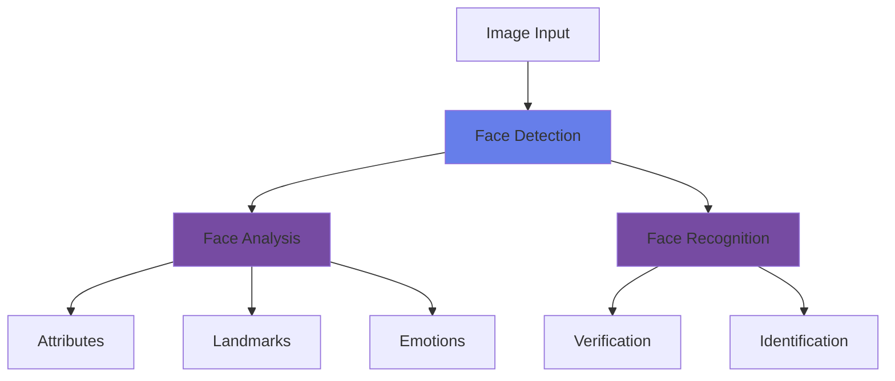

# Detect, Analyze and Recognize Faces

<div class="hero-section">
  <div class="hero-overlay">
    <div class="hero-content">
      <h1>Detect, Analyze and Recognize Faces</h1>
      <p>Detect, analyze, and recognize human faces using Azure Face API</p>
    </div>
  </div>
</div>

## Overview

Face detection and recognition are powerful computer vision capabilities that enable applications to identify and analyze human faces in images. Azure Face API provides comprehensive face detection, verification, identification, and analysis features.

## Topic Notes

### What is Face Detection?

Face detection is the process of locating human faces in images and videos. Azure Face API goes beyond simple detection to provide detailed facial analysis including attributes, landmarks, and recognition capabilities.

### Key Capabilities

#### 1. **Face Detection**

Detect one or more human faces in an image:

- **Face rectangles**: Bounding boxes for each detected face
- **Face landmarks**: 27-point face landmark detection
- **Face attributes**: Age, emotion, gender, pose, blur, exposure, and more

```python
from azure.cognitiveservices.vision.face import FaceClient
from msrest.authentication import CognitiveServicesCredentials

# Initialize the client
credentials = CognitiveServicesCredentials(subscription_key)
face_client = FaceClient(endpoint, credentials)

# Detect faces with attributes
image_url = "https://example.com/photo.jpg"
detected_faces = face_client.face.detect_with_url(
    url=image_url,
    return_face_attributes=[
        'age', 'gender', 'emotion', 'smile', 
        'facialHair', 'glasses', 'accessories'
    ],
    return_face_landmarks=True
)

# Process results
for face in detected_faces:
    print(f"Face ID: {face.face_id}")
    print(f"Age: {face.face_attributes.age}")
    print(f"Emotion: {face.face_attributes.emotion.as_dict()}")
```

#### 2. **Face Attributes**

Azure Face API can analyze various facial attributes:

##### Demographics
- **Age**: Estimated age of the person
- **Gender**: Male or female classification

##### Facial Features
- **Glasses**: No glasses, reading glasses, sunglasses, swimming goggles
- **Facial hair**: Moustache, beard, sideburns with confidence scores
- **Accessories**: Head wear, masks
- **Hair**: Visible, bald, hair color

##### Expressions
- **Emotion**: Anger, contempt, disgust, fear, happiness, neutral, sadness, surprise
- **Smile**: Smile intensity score

##### Image Quality
- **Blur**: Blur level (low, medium, high)
- **Exposure**: Under-exposed, good exposure, over-exposed
- **Noise**: Visual noise level
- **Occlusion**: Forehead, eye, or mouth occlusion

##### Head Pose
- **Pitch**: Head rotation around X-axis
- **Roll**: Head rotation around Z-axis
- **Yaw**: Head rotation around Y-axis

#### 3. **Face Landmarks**

27 specific points on a face:

- Eye corners and pupils
- Nose tip and bottom
- Mouth corners and lips
- Eyebrow points

#### 4. **Face Verification**

Verify if two faces belong to the same person:

```python
# Verify if two faces match
result = face_client.face.verify_face_to_face(
    face_id1=face_id_1,
    face_id2=face_id_2
)

print(f"Same person: {result.is_identical}")
print(f"Confidence: {result.confidence}")
```

#### 5. **Face Identification**

Identify a person from a group:

1. Create a person group
2. Add persons to the group
3. Add face images for each person
4. Train the person group
5. Identify faces against the group

### Architecture Pattern



### Best Practices

!!! tip "Image Quality for Face Detection"
    - **Face size**: Minimum 36x36 pixels
    - **Orientation**: Faces should be frontal or near-frontal
    - **Lighting**: Good, even lighting
    - **Resolution**: Higher resolution improves accuracy
    - **Multiple faces**: API can detect up to 100 faces per image

!!! warning "Privacy and Ethics"
    - Always obtain consent before processing facial data
    - Comply with GDPR and other privacy regulations
    - Store facial data securely
    - Provide transparency about face recognition usage
    - Implement appropriate access controls

### Common Use Cases

1. **Access Control**: Facial recognition for building entry
2. **Attendance Systems**: Automatic attendance tracking
3. **Photo Organization**: Auto-tagging people in photos
4. **Customer Analytics**: Demographic analysis in retail
5. **Security**: Surveillance and monitoring
6. **User Verification**: Identity verification for banking/apps

### Responsible AI Considerations

!!! info "Responsible AI Principles"
    - **Transparency**: Clearly inform users when face recognition is used
    - **Fairness**: Test across diverse demographics
    - **Privacy**: Minimize data collection and retention
    - **Security**: Protect biometric data with encryption
    - **Accountability**: Maintain audit trails

<div class="practice-questions">

### 🎯 Practice Questions

1. **What is the minimum face size that Azure Face API can detect?**
   
   <details>
   <summary>Show Answer</summary>
   36x36 pixels
   </details>

2. **How many faces can Azure Face API detect in a single image?**
   
   <details>
   <summary>Show Answer</summary>
   Up to 100 faces per image
   </details>

3. **What are the three types of head pose attributes returned by the Face API?**
   
   <details>
   <summary>Show Answer</summary>
   Pitch (rotation around X-axis), Roll (rotation around Z-axis), and Yaw (rotation around Y-axis)
   </details>

4. **Name at least five emotions that Azure Face API can detect.**
   
   <details>
   <summary>Show Answer</summary>
   Anger, contempt, disgust, fear, happiness, neutral, sadness, and surprise
   </details>

5. **What is the difference between face verification and face identification?**
   
   <details>
   <summary>Show Answer</summary>
   Face verification (1:1) checks if two faces belong to the same person, while face identification (1:N) identifies a person from a group of known people.
   </details>

6. **How many face landmarks does Azure Face API detect?**
   
   <details>
   <summary>Show Answer</summary>
   27 specific points on a face
   </details>

7. **Why is it important to follow responsible AI principles when implementing face recognition?**
   
   <details>
   <summary>Show Answer</summary>
   To ensure privacy protection, comply with regulations, maintain transparency, ensure fairness across demographics, secure biometric data, and maintain accountability for the system's use.
   </details>

</div>

### Hands-On Exercise

!!! example "Exercise: Build a Face Detection App"
    1. Create an Azure Face resource
    2. Detect faces in an image with multiple people
    3. Extract and display face attributes (age, gender, emotion)
    4. Visualize face bounding boxes and landmarks
    5. Test face verification with two different images
    6. Analyze the confidence scores for different attributes

### Privacy-Preserving Alternatives

For scenarios where full facial recognition isn't needed:

- Use face detection without storing face IDs
- Implement anonymization techniques
- Use aggregate analytics instead of individual tracking
- Consider alternative biometric methods

<div class="resources-section">

## 📚 Resources

- [Azure Face API Documentation](https://learn.microsoft.com/en-us/azure/ai-services/computer-vision/overview-identity)
- [Face Detection Quickstart](https://learn.microsoft.com/en-us/azure/ai-services/computer-vision/quickstarts-sdk/identity-client-library)
- [Face API Reference](https://learn.microsoft.com/en-us/rest/api/face/)
- [Responsible AI for Face](https://learn.microsoft.com/en-us/legal/cognitive-services/face/transparency-note)
- [Privacy and Security Guidelines](https://learn.microsoft.com/en-us/azure/ai-services/computer-vision/identity-privacy-security)
- [Face API Pricing](https://azure.microsoft.com/en-us/pricing/details/cognitive-services/face-api/)

</div>

---

[← Previous: Read Text in Images](read-text-in-images.md) | [Next: Classify Images →](classify-images.md)
