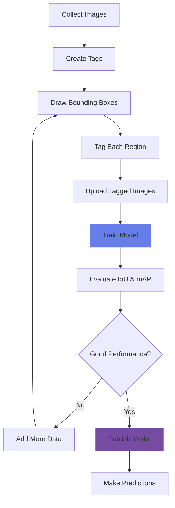

# Detect Objects in Images

<div class="hero-section">
  <div class="hero-overlay">
    <div class="hero-content">
      <h1>Detect Objects in Images</h1>
      <p>Locate and identify multiple objects within images using Azure Custom Vision and AI Vision</p>
    </div>
  </div>
</div>

## Overview

Object detection goes beyond image classification by not only identifying what objects are present in an image but also locating where they appear. Azure provides multiple services for object detection, from pre-built models to custom-trained solutions.

## Topic Notes

### What is Object Detection?

Object detection combines classification and localization to identify multiple objects in an image and provide bounding boxes around each detected object. Each detection includes:

- **Object class**: What the object is
- **Confidence score**: How confident the model is
- **Bounding box**: Where the object is located (x, y, width, height)

### Key Capabilities

#### 1. **Azure AI Vision - Object Detection**

Pre-trained object detection for common objects:

```python
from azure.ai.vision.imageanalysis import ImageAnalysisClient
from azure.ai.vision.imageanalysis.models import VisualFeatures
from azure.core.credentials import AzureKeyCredential

# Initialize client
client = ImageAnalysisClient(
    endpoint=endpoint,
    credential=AzureKeyCredential(key)
)

# Detect objects
result = client.analyze_from_url(
    image_url=image_url,
    visual_features=[VisualFeatures.OBJECTS]
)

# Process detections
for obj in result.objects:
    print(f"Object: {obj.tags[0].name}")
    print(f"Confidence: {obj.tags[0].confidence:.2%}")
    print(f"Bounding box: {obj.bounding_box}")
```

#### 2. **Azure Custom Vision - Object Detection**

Train custom object detection models for specific objects:

```python
from azure.cognitiveservices.vision.customvision.training import CustomVisionTrainingClient
from azure.cognitiveservices.vision.customvision.training.models import ImageFileCreateBatch, ImageFileCreateEntry, Region

# Create an object detection project
project = trainer.create_project(
    name="Product Detector",
    project_type="ObjDetection",
    domain_id=domain.id
)

# Create tags
tag1 = trainer.create_tag(project.id, "laptop")
tag2 = trainer.create_tag(project.id, "phone")

# Upload and tag images with regions
with open("image.jpg", "rb") as image_file:
    image_data = image_file.read()
    
    # Define bounding box (normalized coordinates 0-1)
    regions = [
        Region(
            tag_id=tag1.id,
            left=0.1,    # x coordinate of top-left corner
            top=0.2,     # y coordinate of top-left corner
            width=0.3,   # width of box
            height=0.4   # height of box
        )
    ]
    
    trainer.create_images_from_files(
        project.id,
        images=[
            ImageFileCreateEntry(
                name="image.jpg",
                contents=image_data,
                regions=regions
            )
        ]
    )
```

### Object Detection vs. Image Classification

| Feature | Classification | Object Detection |
|---------|---------------|------------------|
| **Output** | Image-level labels | Object locations + labels |
| **Bounding boxes** | No | Yes |
| **Multiple objects** | Multilabel only | Yes, with locations |
| **Use case** | "What is in this image?" | "Where is each object?" |
| **Complexity** | Lower | Higher |

### Training Process



### Performance Metrics

#### Intersection over Union (IoU)

Measures overlap between predicted and actual bounding boxes:

- **IoU > 0.5**: Generally considered a good detection
- **IoU > 0.7**: High-quality detection
- **IoU = 1.0**: Perfect overlap

#### Mean Average Precision (mAP)

Overall model performance metric:

- Combines precision and recall across all classes
- Standard benchmark for object detection
- Higher is better (0-1 scale)

### Best Practices

!!! tip "Training Data Requirements"
    - **Minimum**: 15 images per object class
    - **Recommended**: 50+ images per object class
    - **Diversity**: Various sizes, angles, lighting, backgrounds
    - **Multiple objects**: Include images with multiple objects
    - **Negative examples**: Images without any target objects

!!! tip "Bounding Box Guidelines"
    - **Tight bounds**: Box should closely fit the object
    - **Complete object**: Include the entire object
    - **Consistency**: Be consistent across all images
    - **Overlapping objects**: Tag each separately
    - **Partial objects**: Only tag if majority is visible

!!! warning "Common Challenges"
    - **Occlusion**: Objects partially hidden behind others
    - **Scale variation**: Same object at different sizes
    - **Crowded scenes**: Many objects close together
    - **Similar objects**: Objects that look alike
    - **Poor lighting**: Shadows, glare, low light

### Use Cases

1. **Retail Analytics**: Count products on shelves, detect out-of-stock
2. **Manufacturing**: Detect defects or foreign objects on production line
3. **Autonomous Vehicles**: Detect pedestrians, vehicles, traffic signs
4. **Security**: Detect unauthorized objects or intrusions
5. **Agriculture**: Detect pests, diseases, or ripe fruit
6. **Healthcare**: Detect anomalies in medical imaging
7. **Logistics**: Detect and track packages, pallets

### Advanced Techniques

#### Multi-Scale Detection

Handle objects at different scales:
- Train with images at various resolutions
- Use image pyramids during inference
- Implement scale-invariant features

#### Handling Small Objects

Tips for detecting small objects:
- Use higher resolution images
- Increase training data for small objects
- Adjust IoU threshold for evaluation
- Consider specialized architectures

#### Real-Time Detection

For real-time applications:
- Use compact domains for faster inference
- Export to edge devices (mobile, IoT)
- Optimize model size vs. accuracy
- Implement efficient preprocessing

<div class="practice-questions">

### 🎯 Practice Questions

1. **What is the main difference between object detection and image classification?**
   
   <details>
   <summary>Show Answer</summary>
   Object detection identifies what objects are present AND where they are located (with bounding boxes), while image classification only identifies what is in the image without location information.
   </details>

2. **What information does each object detection result include?**
   
   <details>
   <summary>Show Answer</summary>
   Object class/label, confidence score, and bounding box coordinates (x, y, width, height).
   </details>

3. **What is IoU, and what value is generally considered a good detection?**
   
   <details>
   <summary>Show Answer</summary>
   IoU (Intersection over Union) measures the overlap between predicted and actual bounding boxes. An IoU > 0.5 is generally considered a good detection, and IoU > 0.7 is considered high-quality.
   </details>

4. **What is the minimum number of images recommended per object class for training?**
   
   <details>
   <summary>Show Answer</summary>
   Minimum: 15 images per object class, but 50+ images per class is recommended for better accuracy.
   </details>

5. **What does mAP stand for, and what does it measure?**
   
   <details>
   <summary>Show Answer</summary>
   mAP stands for Mean Average Precision. It combines precision and recall across all classes to provide an overall measure of the object detection model's performance.
   </details>

6. **Why is it important to include images with multiple objects when training an object detection model?**
   
   <details>
   <summary>Show Answer</summary>
   Including images with multiple objects helps the model learn to detect and distinguish multiple instances in real-world scenarios, improving its ability to handle crowded or complex scenes.
   </details>

7. **What are the bounding box coordinates in Custom Vision normalized to?**
   
   <details>
   <summary>Show Answer</summary>
   Coordinates are normalized between 0 and 1, where (0,0) is the top-left corner and (1,1) is the bottom-right corner of the image.
   </details>

</div>

### Hands-On Exercise

!!! example "Exercise: Build an Object Detector"
    1. Create a Custom Vision Object Detection project
    2. Choose a domain (General or specific)
    3. Create at least 2-3 object tags
    4. Collect or find 20-30 images with your target objects
    5. Draw bounding boxes around objects in each image
    6. Tag each bounding box with the appropriate label
    7. Train the model
    8. Test with new images and evaluate IoU/mAP
    9. Iterate: add more data where detections are weak

### Troubleshooting Common Issues

| Issue | Solution |
|-------|----------|
| Missing small objects | Increase image resolution, add more small object examples |
| False positives | Add negative examples, increase confidence threshold |
| Poor localization | Improve bounding box accuracy in training data |
| Overlapping detections | Adjust non-maximum suppression (NMS) threshold |
| Class confusion | Add more diverse examples for confused classes |

<div class="resources-section">

## 📚 Resources

- [Azure AI Vision Object Detection](https://learn.microsoft.com/en-us/azure/ai-services/computer-vision/concept-object-detection)
- [Custom Vision Object Detection](https://learn.microsoft.com/en-us/azure/ai-services/custom-vision-service/get-started-build-detector)
- [Object Detection Quickstart](https://learn.microsoft.com/en-us/azure/ai-services/custom-vision-service/quickstarts/object-detection)
- [Best Practices for Object Detection](https://learn.microsoft.com/en-us/azure/ai-services/custom-vision-service/getting-started-improving-your-classifier)
- [Understanding mAP and IoU](https://learn.microsoft.com/en-us/azure/ai-services/custom-vision-service/probability-threshold)
- [Custom Vision API Reference](https://learn.microsoft.com/en-us/rest/api/customvision/)

</div>

---

[← Previous: Classify Images](classify-images.md) | [Next: Analyze Video →](analyze-video.md)
