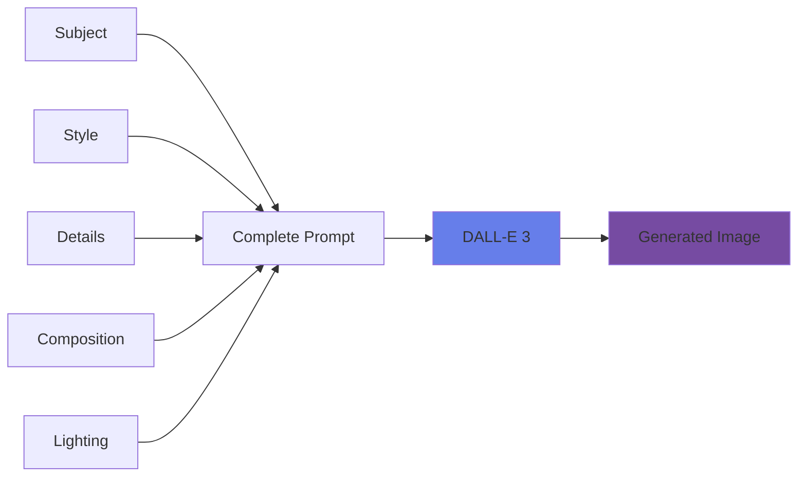
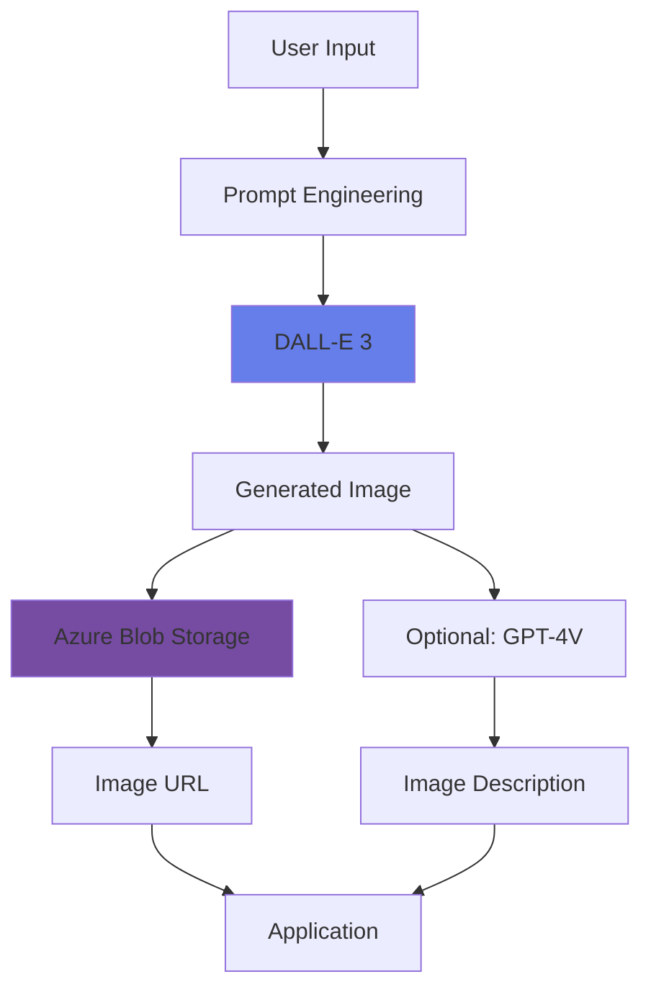

# Generate Images with AI

<div class="hero-container">
  
</div>

## Overview

AI image generation represents a revolutionary capability in computer vision, enabling the creation of original images from natural language descriptions. Azure OpenAI's DALL-E models can generate, edit, and create variations of images based on text prompts.

## Topic Notes

### What is AI Image Generation?

AI image generation uses deep learning models trained on vast datasets of images and their descriptions to create new, original images from text prompts. DALL-E (named after Salvador Dalí and WALL-E) is OpenAI's image generation model available through Azure OpenAI Service.

### Key Capabilities

#### 1. **DALL-E 3 Features**

The latest DALL-E model provides:

- **Higher quality**: More realistic and detailed images
- **Better prompt following**: More accurate interpretation of descriptions
- **Improved safety**: Enhanced content filtering
- **Multiple styles**: Natural, vivid, realistic, artistic styles
- **HD quality**: Optional high-definition output

```python
from openai import AzureOpenAI
import os

# Initialize client
client = AzureOpenAI(
    api_key=os.getenv("AZURE_OPENAI_API_KEY"),
    api_version="2024-02-01",
    azure_endpoint=os.getenv("AZURE_OPENAI_ENDPOINT")
)

# Generate an image
response = client.images.generate(
    model="dall-e-3",
    prompt="A serene Japanese garden with a wooden bridge over a koi pond, cherry blossoms, and Mount Fuji in the background, digital art style",
    size="1024x1024",
    quality="standard",  # or "hd"
    style="vivid",  # or "natural"
    n=1
)

# Get the generated image URL
image_url = response.data[0].url
print(f"Generated image: {image_url}")
```

#### 2. **Image Generation Options**

##### Size Options
- **1024x1024**: Square format (default)
- **1792x1024**: Landscape format
- **1024x1792**: Portrait format

##### Quality Options
- **Standard**: Faster generation, lower cost
- **HD**: Higher detail and quality, higher cost

##### Style Options
- **Vivid**: More hyper-real and dramatic images
- **Natural**: More natural, less hyper-real images

### Prompt Engineering for Image Generation



#### Effective Prompt Components

1. **Subject**: What you want to see
   - "A golden retriever"
   - "A modern skyscraper"
   - "A fantasy dragon"

2. **Style**: Artistic approach
   - "digital art"
   - "oil painting"
   - "photorealistic"
   - "watercolor"
   - "3D render"

3. **Details**: Specific attributes
   - Colors, textures, materials
   - Emotions, expressions
   - Time of day, season

4. **Composition**: Layout and perspective
   - "close-up"
   - "aerial view"
   - "wide angle"
   - "centered"

5. **Lighting and Mood**
   - "golden hour lighting"
   - "dramatic shadows"
   - "soft ambient light"
   - "cinematic"

#### Prompt Examples

```python
# Example 1: Product Visualization
prompt = "A sleek modern laptop on a minimalist desk, soft natural lighting from the left, white background, professional product photography style"

# Example 2: Fantasy Scene
prompt = "A mystical forest with glowing mushrooms, ethereal blue fog, ancient trees with twisted roots, moonlight filtering through leaves, fantasy art style"

# Example 3: Character Design
prompt = "A friendly robot character with a round body, expressive LED eyes, metallic blue and silver finish, cartoon style, standing in a futuristic laboratory"

# Example 4: Landscape
prompt = "A dramatic mountain landscape at sunset, snow-capped peaks, alpine lake reflecting orange and pink clouds, pine trees in foreground, hyper-realistic photography"
```

### Best Practices

!!! tip "Prompt Writing Tips"
    - **Be specific**: More details lead to better results
    - **Use descriptive language**: Adjectives and adverbs help
    - **Specify style**: Mention artistic style or medium
    - **Describe composition**: State perspective and layout
    - **Iterate**: Refine prompts based on results
    - **Keep it reasonable**: Extremely complex prompts may not work well

!!! warning "Content Policy"
    - No harmful or offensive content
    - No public figures or copyrighted characters
    - No personal identifiable information
    - No misleading or deceptive content
    - Content filtering is automatic

### Use Cases

1. **Marketing & Advertising**: Create unique visuals for campaigns
2. **Product Mockups**: Visualize products before manufacturing
3. **Concept Art**: Generate ideas for games, movies, or design projects
4. **Social Media**: Create engaging, original content
5. **Education**: Generate illustrations for learning materials
6. **E-commerce**: Create product variations and backgrounds
7. **Storytelling**: Illustrate stories, books, or presentations
8. **Prototyping**: Visualize UI/UX designs and concepts

### Advanced Techniques

#### Iterative Refinement

```python
# Start broad
prompt_v1 = "A coffee shop interior"

# Add details
prompt_v2 = "A cozy coffee shop interior with wooden furniture, hanging plants, and warm lighting"

# Refine style
prompt_v3 = "A cozy coffee shop interior with wooden furniture, hanging plants, and warm lighting, Scandinavian design style, afternoon sun streaming through large windows"

# Final touches
prompt_v4 = "A cozy coffee shop interior with wooden furniture, hanging plants, and warm lighting, Scandinavian design style, afternoon sun streaming through large windows, people enjoying coffee, realistic photography"
```

#### Combining with Other Services

```python
# 1. Generate image with DALL-E
image_response = client.images.generate(
    model="dall-e-3",
    prompt="A modern living room with smart home devices",
    size="1024x1024"
)

# 2. Analyze with GPT-4V
vision_response = client.chat.completions.create(
    model="gpt-4-vision-preview",
    messages=[
        {
            "role": "user",
            "content": [
                {"type": "text", "text": "Describe this generated image and suggest improvements"},
                {"type": "image_url", "image_url": {"url": image_response.data[0].url}}
            ]
        }
    ]
)

# 3. Refine prompt based on feedback
```

### Architecture Example



<div class="practice-questions">

### 🎯 Practice Questions

1. **What are the three size options available for DALL-E 3 image generation?**
   
   <details>
   <summary>Show Answer</summary>
   1024x1024 (square), 1792x1024 (landscape), and 1024x1792 (portrait)
   </details>

2. **What is the difference between "vivid" and "natural" style options?**
   
   <details>
   <summary>Show Answer</summary>
   "Vivid" creates more hyper-real and dramatic images, while "natural" produces more natural, less hyper-real images.
   </details>

3. **What are the five key components of an effective image generation prompt?**
   
   <details>
   <summary>Show Answer</summary>
   Subject (what you want), Style (artistic approach), Details (specific attributes), Composition (layout/perspective), and Lighting/Mood.
   </details>

4. **What is the difference between "standard" and "HD" quality options?**
   
   <details>
   <summary>Show Answer</summary>
   Standard quality is faster and lower cost with good quality, while HD provides higher detail and quality at a higher cost.
   </details>

5. **Why is DALL-E called DALL-E?**
   
   <details>
   <summary>Show Answer</summary>
   It's a portmanteau of Salvador Dalí (the surrealist artist) and WALL-E (the Pixar robot character).
   </details>

6. **What types of content are not allowed when generating images with DALL-E?**
   
   <details>
   <summary>Show Answer</summary>
   Harmful or offensive content, public figures or copyrighted characters, personally identifiable information, and misleading or deceptive content.
   </details>

7. **How can you improve an image generation prompt iteratively?**
   
   <details>
   <summary>Show Answer</summary>
   Start broad, add specific details, refine the style, include composition and lighting details, and iterate based on results.
   </details>

</div>

### Hands-On Exercise

!!! example "Exercise: Generate Custom Images"
    1. Set up Azure OpenAI with DALL-E 3 access
    2. Start with a simple prompt and generate an image
    3. Iteratively refine the prompt:
        - Add style specifications
        - Include lighting details
        - Specify composition
        - Add mood descriptors
    4. Try different size formats (square, landscape, portrait)
    5. Compare standard vs. HD quality
    6. Test both vivid and natural styles
    7. Save your best results and document what worked

### Cost Optimization

- **Standard quality**: Use for most applications
- **HD quality**: Reserve for final production images
- **Prompt refinement**: Test with standard before HD
- **Caching**: Store generated images in Azure Storage
- **Reuse**: Create variations rather than completely new images

### Ethical Considerations

!!! info "Responsible Image Generation"
    - **Attribution**: Clearly mark AI-generated content
    - **Accuracy**: Don't use for misleading representations
    - **Copyright**: Respect intellectual property
    - **Bias**: Be aware of potential biases in generated content
    - **Privacy**: Don't attempt to recreate specific individuals
    - **Transparency**: Disclose when images are AI-generated

<div class="resources-section">

## 📚 Resources

- [Azure OpenAI DALL-E Documentation](https://learn.microsoft.com/en-us/azure/ai-services/openai/how-to/dall-e)
- [DALL-E 3 Quickstart](https://learn.microsoft.com/en-us/azure/ai-services/openai/dall-e-quickstart)
- [Image Generation API Reference](https://learn.microsoft.com/en-us/azure/ai-services/openai/reference)
- [Prompt Engineering for Images](https://learn.microsoft.com/en-us/azure/ai-services/openai/concepts/prompt-engineering)
- [Content Filtering](https://learn.microsoft.com/en-us/azure/ai-services/openai/concepts/content-filter)
- [Azure OpenAI Pricing](https://azure.microsoft.com/en-us/pricing/details/cognitive-services/openai-service/)

</div>

---

[← Previous: Develop a Vision-Enabled Gen AI App](vision-enabled-gen-ai-app.md)

## 🎉 Congratulations!

You've completed all chapters of the Applied Skills - Computer Vision course! You now have comprehensive knowledge of:

- ✅ Analyzing images with Azure AI Vision
- ✅ Reading text from images with OCR
- ✅ Detecting and recognizing faces
- ✅ Building custom image classifiers
- ✅ Detecting objects in images
- ✅ Analyzing video content
- ✅ Integrating vision with generative AI
- ✅ Generating images with AI

Continue practicing these skills and explore the [Resources](../resources.md) page for more learning materials!
