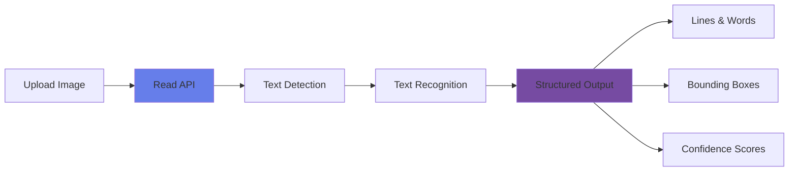

# Read Text in Images

<div class="hero-container">
  
</div>

## Overview

# OCR: The Superpower for Reading Pictures

Imagine if your camera or computer could magically read words from anything—a street sign, a hand-written note, even the back of your cereal box—and then turn those words into actual text you can copy, search, or translate. That superpower is called **OCR**—which stands for **Optical Character Recognition**.

You can think of OCR like giving your computer superhero vision:
1. **Snap a picture** (of a menu, book, sign, etc.).
2. OCR puts on its detective glasses and scans all the shapes and squiggles in the image.
3. It figures out which shapes are actually letters and words.
4. **Shazam!** It types out the text, as if by magic, ready for you to use however you want.

---

## Why is OCR Awesome?

- Can quickly turn mountains of paper into searchable digital files (“Goodbye, paper cuts!”)
- Makes the text from signs, screenshots, memes, or photos actually usable
- Great for translations while traveling (point phone at a sign in Tokyo, read it in English)
- Lets you secretly copy grandma’s legendary cookie recipe right off the fridge

---

## Fun Fact

OCR isn’t just for printed stuff—it’s clever enough these days to read your messy handwriting, solve Sudoku puzzles from a camera snapshot, or even recognize numbers on old arcade machines!

---

## Example

Let’s say you have this image:

```
  +---------------------------+
  |   Free Pizza Upstairs!    |
  +---------------------------+
```
You point your phone, use OCR, and—**BAM!**—it tells you:  
**"Free Pizza Upstairs!"** (And now you know exactly where to go 😁)

---

**In short:**  
OCR is the magical bridge between the world you can see and the world your computer can read. It unlocks hidden words everywhere! 


## Topic Notes

### What is OCR?

Optical Character Recognition (OCR) is the technology that converts images of text into machine-readable text. Azure's Read API uses deep learning models to recognize text in various languages, fonts, and styles.

### Key Capabilities

#### 1. **Read API**

The Read API is Azure's latest OCR technology:

- **High accuracy**: Deep learning-based text recognition
- **Multiple languages**: Supports 160+ languages
- **Mixed content**: Handles printed and handwritten text
- **Complex layouts**: Processes multi-column documents
- **Large documents**: Can process up to 500 pages

```python
from azure.ai.vision.imageanalysis import ImageAnalysisClient
from azure.ai.vision.imageanalysis.models import VisualFeatures
from azure.core.credentials import AzureKeyCredential

# Initialize the client
client = ImageAnalysisClient(
    endpoint=endpoint,
    credential=AzureKeyCredential(key)
)

# Read text from image
result = client.analyze_from_url(
    image_url=image_url,
    visual_features=[VisualFeatures.READ]
)

# Process results
if result.read is not None:
    for line in result.read.blocks[0].lines:
        print(f"Line: '{line.text}'")
        print(f"Bounding box: {line.bounding_polygon}")
```

#### 2. **Text Recognition Features**

##### Printed Text
- High accuracy for machine-printed text
- Multiple fonts and styles
- Various text sizes

##### Handwritten Text
- Recognition of handwritten notes
- Cursive and print writing styles
- Natural handwriting variations

##### Text in Images
- Text overlay on images
- Street signs and billboards
- Product labels and packaging

#### 3. **Language Support**

Azure OCR supports over 160 languages including:

- **Latin scripts**: English, Spanish, French, German, Italian, Portuguese
- **Cyrillic scripts**: Russian, Ukrainian, Bulgarian
- **Asian languages**: Chinese (Simplified & Traditional), Japanese, Korean
- **Arabic scripts**: Arabic, Persian, Urdu
- **Indic scripts**: Hindi, Bengali, Tamil, Telugu

### Text Extraction Process



### Best Practices

!!! tip "Image Optimization"
    - **Resolution**: Minimum 50x50, recommended 300 DPI for documents
    - **Orientation**: Ensure text is right-side up (or use auto-rotation)
    - **Contrast**: High contrast between text and background
    - **Clarity**: Avoid blur and distortion

!!! warning "API Considerations"
    - Image size limit: 50 MB
    - Format support: JPEG, PNG, BMP, PDF, TIFF
    - Async operation for large documents
    - Rate limits based on pricing tier

### Common Use Cases

1. **Document Digitization**: Convert paper documents to digital text
2. **Invoice Processing**: Extract data from invoices and receipts
3. **Form Recognition**: Read form fields and checkboxes
4. **License Plate Recognition**: Read vehicle registration plates
5. **Sign Translation**: Translate text from street signs and menus
6. **Accessibility**: Convert images to screen-reader friendly text

### Advanced Features

#### Bounding Polygons

Get precise location of detected text:

```json
{
  "text": "Computer Vision",
  "boundingPolygon": [
    {"x": 100, "y": 50},
    {"x": 300, "y": 50},
    {"x": 300, "y": 100},
    {"x": 100, "y": 100}
  ]
}
```

#### Text Hierarchy

Results are organized hierarchically:
- **Pages**: For multi-page documents
- **Lines**: Continuous text lines
- **Words**: Individual words with confidence scores

<div class="practice-questions">

### 🎯 Practice Questions

1. **What is the main difference between the Read API and older OCR technologies in Azure?**
   
   <details>
   <summary>Show Answer</summary>
   The Read API uses deep learning models for higher accuracy, supports both printed and handwritten text, handles complex layouts, and can process large multi-page documents up to 500 pages.
   </details>

2. **How many languages does Azure AI Vision's OCR support?**
   
   <details>
   <summary>Show Answer</summary>
   Over 160 languages, including Latin, Cyrillic, Asian, Arabic, and Indic scripts.
   </details>

3. **What is the maximum file size for images processed by the Read API?**
   
   <details>
   <summary>Show Answer</summary>
   50 MB (megabytes)
   </details>

4. **What are bounding polygons, and why are they useful?**
   
   <details>
   <summary>Show Answer</summary>
   Bounding polygons are coordinates that define the precise location of detected text in an image. They're useful for highlighting text, creating interactive overlays, and understanding document layout.
   </details>

5. **What is the recommended DPI (dots per inch) for document images to achieve best OCR results?**
   
   <details>
   <summary>Show Answer</summary>
   300 DPI (dots per inch) is recommended for document scanning to achieve optimal OCR accuracy.
   </details>

6. **Can the Read API process both printed and handwritten text in the same image?**
   
   <details>
   <summary>Show Answer</summary>
   Yes, the Read API can handle mixed content with both printed and handwritten text in the same image.
   </details>

7. **What file formats does the Read API support?**
   
   <details>
   <summary>Show Answer</summary>
   JPEG, PNG, BMP, PDF, and TIFF formats are supported.
   </details>

</div>

### Hands-On Exercise

!!! example "Exercise: Extract Text from a Document"
    1. Find or create an image with text (could be a photo of a document, sign, or receipt)
    2. Use the Read API to extract all text
    3. Display the extracted text with confidence scores
    4. Visualize bounding boxes on the original image
    5. Try with both printed and handwritten text samples

### Performance Tips

- **Preprocessing**: Enhance image quality before OCR
- **Orientation**: Correct image rotation for better results
- **Noise reduction**: Remove background noise and artifacts
- **Binarization**: Convert to black and white for certain document types

## 📚 Resources

- [Read API Overview](https://learn.microsoft.com/en-us/azure/ai-services/computer-vision/overview-ocr)
- [OCR Quickstart Guide](https://learn.microsoft.com/en-us/azure/ai-services/computer-vision/quickstarts-sdk/client-library)
- [Read API Reference](https://learn.microsoft.com/en-us/rest/api/computervision/read)
- [Language Support](https://learn.microsoft.com/en-us/azure/ai-services/computer-vision/language-support)
- [OCR Best Practices](https://learn.microsoft.com/en-us/azure/ai-services/computer-vision/how-to/call-read-api)
- [Sample Code Repository](https://github.com/Azure-Samples/cognitive-services-quickstart-code)
- [Read Text in Images - Applied Skills](https://learn.microsoft.com/en-us/training/modules/read-text-images-documents-with-computer-vision-service/)

---

[← Previous: Analyze Images](analyze-images.md) | [Next: Detect, Analyze and Recognize Faces →](detect-analyze-recognize-faces.md)
