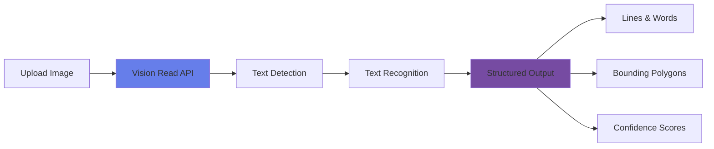

# Read Text in Images

<div class="hero-container">
  
</div>

## Overview

# Azure AI Vision Read: The Superpower for Reading Pictures

Imagine if your camera or computer could magically read words from anything—a street sign, a handwritten note, or even the back of your cereal box—and then turn those words into real text you can copy, search, or translate. That superpower was once called **OCR** (Optical Character Recognition), but with Azure, it’s now supercharged as **Azure AI Vision Read**!

Think of Azure Vision Read as upgrading your computer’s superhero vision:
1. **Snap a picture** (of a menu, book, sign, etc.).
2. Azure Vision Read scans all the shapes and squiggles in the image.
3. It figures out which shapes are actually letters and words.
4. **Shazam!** It types out the text, ready for you to use however you want.

---

## Why is Azure Vision Read Awesome?

- Instantly turns paper mountains into searchable digital files (“Goodbye, paper cuts!”)
- Makes words in screenshots, memes, or photos actually usable
- Amazing for translation on the go (point phone at a sign and see it in your language)
- Lets you secretly copy grandma’s legendary cookie recipe right off the fridge
- Reads both printed and handwritten text—even the messy stuff!

---

## Fun Fact

Azure Vision Read goes beyond classic OCR! It can decode your messy handwriting, solve Sudoku puzzles from a camera snapshot, or even recognize numbers on vintage arcade machines.

**In short:**  
Azure Vision Read is the magical bridge between the world you can see and the world your computer can read—unlocking hidden words everywhere!

---

## Topic Notes

### What is Azure AI Vision Read?

Azure AI Vision Read is the next-generation OCR service from Microsoft, using advanced deep learning to convert images of text into machine-readable text. It replaces the older OCR and Read features in Azure Computer Vision, giving you more languages, better accuracy, and smarter layouts.

### Key Capabilities

#### 1. **Vision Read API**

The Vision Read API is Azure's latest and greatest for reading text from images:

- **Ultra-high accuracy** using deep learning
- **Massive language support**: 160+ languages and scripts
- **Gets both printed and handwritten text** (even mixed together)
- **Handles complex layouts**: multi-column, tables, and forms
- **Processes long documents**: up to 500 pages in a single PDF

```python
from azure.ai.vision.imageanalysis import ImageAnalysisClient
from azure.ai.vision.imageanalysis.models import VisualFeatures
from azure.core.credentials import AzureKeyCredential

# Initialize the client
client = ImageAnalysisClient(
    endpoint=endpoint,
    credential=AzureKeyCredential(key)
)

# Read text from image
result = client.analyze_from_url(
    image_url=image_url,
    visual_features=[VisualFeatures.READ]
)

# Process results
if result.read is not None:
    for line in result.read.blocks[0].lines:
        print(f"Line: '{line.text}'")
        print(f"Bounding box: {line.bounding_polygon}")
```
*(This example uses the modern Azure Vision Read approach, not the legacy OCR API.)*

#### 2. **Text Recognition Features**

##### Printed Text
- High accuracy for machine-printed text in many fonts/styles/sizes

##### Handwritten Text
- Reads notes, lists, cursive, and artistic (messy) handwriting

##### Text in Images
- Detects text on street signs, product packaging, images, and more!

#### 3. **Language Support**

Azure Vision Read supports over 160 languages, including:

- **Latin scripts**: English, Spanish, French, German, Italian, Portuguese
- **Cyrillic scripts**: Russian, Ukrainian, Bulgarian
- **Asian languages**: Chinese (Simplified & Traditional), Japanese, Korean
- **Arabic scripts**: Arabic, Persian, Urdu
- **Indic scripts**: Hindi, Bengali, Tamil, Telugu

### Text Extraction Process



### Best Practices

!!! tip "Image Optimization"
    - **Resolution**: Minimum 50x50 pixels, 300 DPI recommended for documents
    - **Orientation**: Keep text upright, or use auto-rotate
    - **Contrast**: High contrast between text and background works best
    - **Clarity**: Avoid blur, distortion, or glare

!!! warning "API Considerations"
    - Image size limit: 50 MB
    - Supported formats: JPEG, PNG, BMP, PDF, TIFF
    - Use async operation for big documents
    - Rate limits depend on your pricing tier

### Common Use Cases

1. **Document Digitization**: Make paper docs usable on a computer
2. **Invoice Processing**: Extract and analyze data from receipts and invoices
3. **Form Recognition**: Read info from forms, even with checkboxes!
4. **License Plate Recognition**: Detect and read vehicle plates in images
5. **Sign Translation**: Translate street signs instantly when traveling
6. **Accessibility**: Feed images into screen readers for visually-impaired access

### Advanced Features

#### Bounding Polygons

Find the *exact* place each word appears in the image!

```json
{
  "text": "Azure Vision Read",
  "boundingPolygon": [
    {"x": 100, "y": 50},
    {"x": 300, "y": 50},
    {"x": 300, "y": 100},
    {"x": 100, "y": 100}
  ]
}
```

#### Text Hierarchy

Results are organized for real-world docs:
- **Pages**: For multi-page PDFs/images
- **Lines**: Each line of text, grouped for you
- **Words**: Each word, with location and confidence

<div class="practice-questions">

### 🎯 Practice Questions

1. **What improvements does Vision Read have over earlier Azure OCR?**
   
   <details>
   <summary>Show Answer</summary>
   Azure Vision Read uses powerful AI for higher accuracy, reads both printed and handwritten text (even mixed), handles complex layouts, and processes up to 500 pages in a single request.
   </details>

2. **How many languages does Azure Vision Read support?**
   
   <details>
   <summary>Show Answer</summary>
   Over 160, covering Latin, Cyrillic, Asian, Arabic, and Indic scripts.
   </details>

3. **What is the maximum file size for images processed by Vision Read?**
   
   <details>
   <summary>Show Answer</summary>
   50 MB (megabytes)
   </details>

4. **What is a bounding polygon, and how does it help?**
   
   <details>
   <summary>Show Answer</summary>
   Bounding polygons are sets of coordinates showing where detected text appears in the image. They’re useful for drawing boxes around words or highlighting text visually.
   </details>

5. **What's the recommended DPI for scanning documents for Vision Read?**
   
   <details>
   <summary>Show Answer</summary>
   300 DPI (dots per inch) for best results and accuracy.
   </details>

6. **Can Azure Vision Read process both print and handwriting in the same image?**
   
   <details>
   <summary>Show Answer</summary>
   Yes! It can handle mixed printed and handwritten text in one go.
   </details>

7. **Which file formats does Vision Read accept?**
   
   <details>
   <summary>Show Answer</summary>
   JPEG, PNG, BMP, PDF, and TIFF.
   </details>

</div>

### Hands-On Exercise

!!! example "Exercise: Extract Text from a Document"
    1. Find or snap a photo with text (a document, sign, or even a receipt)
    2. Use Azure Vision Read to pull out the text
    3. Display the text and each word’s confidence score
    4. Visualize bounding polygons on the image
    5. Test with both printed and handwritten samples

[Lab Exercise](https://microsoftlearning.github.io/mslearn-ai-vision/Instructions/Labs/02-ocr.html)

### Performance Tips

- **Preprocessing**: Clean up the image before sending (contrast, sharpness)
- **Orientation**: Make sure text is upright and clear
- **Noise reduction**: Remove stray marks or background clutter
- **Binarization**: Black-and-white conversion can help for some documents

## 📚 Resources

- [Vision Read Quickstart Guide](https://learn.microsoft.com/en-us/azure/ai-services/computer-vision/quickstarts-sdk/client-library)
- [Read API Reference](https://learn.microsoft.com/en-us/rest/api/computervision/read)
- [Language Support](https://learn.microsoft.com/en-us/azure/ai-services/computer-vision/language-support)
- [Vision Read Best Practices](https://learn.microsoft.com/en-us/azure/ai-services/computer-vision/how-to/call-read-api)
- [Sample Code Repository](https://github.com/Azure-Samples/cognitive-services-quickstart-code)
- [Read Text in Images - Applied Skills](https://learn.microsoft.com/en-us/training/modules/read-text-images-documents-with-computer-vision-service/)

---

[← Previous: Analyze Images](analyze-images.md) | [Next: Detect, Analyze and Recognize Faces →](detect-analyze-recognize-faces.md)