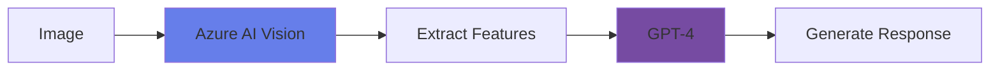
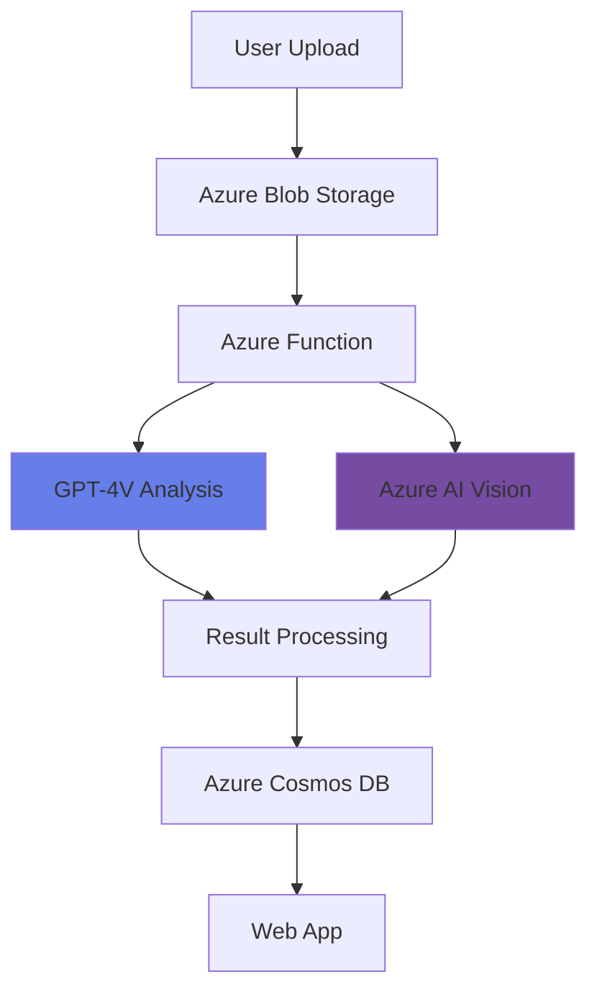

# Develop a Vision-Enabled Gen AI App

<div class="hero-section">
  <div class="hero-overlay">
    <div class="hero-content">
      <h1>Vision-Enabled Gen AI App</h1>
      <p>Integrate computer vision with generative AI using Azure OpenAI and GPT-4 Vision</p>
    </div>
  </div>
</div>

## Overview

Vision-enabled generative AI applications combine the power of computer vision and large language models to understand, describe, and reason about visual content. Azure OpenAI's GPT-4 Vision (GPT-4V) enables developers to build applications that can see and understand images.

## Topic Notes

### What is Vision-Enabled Gen AI?

Vision-enabled Gen AI refers to applications that use multimodal AI models (like GPT-4 Vision) to process both text and images, enabling natural language interactions about visual content. These models can describe images, answer questions about them, and even reason about visual information.

### Key Capabilities

#### 1. **GPT-4 Vision (GPT-4V)**

Azure OpenAI's GPT-4V combines language understanding with vision:

- **Image understanding**: Describe and interpret images
- **Visual reasoning**: Answer questions about images
- **Multi-image analysis**: Compare multiple images
- **Text extraction**: Read and interpret text in images
- **Visual question answering**: Answer specific questions about visual content

```python
from openai import AzureOpenAI
import base64

# Initialize client
client = AzureOpenAI(
    api_key=api_key,
    api_version="2024-02-01",
    azure_endpoint=endpoint
)

# Encode image to base64
def encode_image(image_path):
    with open(image_path, "rb") as image_file:
        return base64.b64encode(image_file.read()).decode('utf-8')

# Analyze image with GPT-4V
base64_image = encode_image("photo.jpg")

response = client.chat.completions.create(
    model="gpt-4-vision-preview",
    messages=[
        {
            "role": "user",
            "content": [
                {
                    "type": "text",
                    "text": "What's in this image? Describe it in detail."
                },
                {
                    "type": "image_url",
                    "image_url": {
                        "url": f"data:image/jpeg;base64,{base64_image}"
                    }
                }
            ]
        }
    ],
    max_tokens=500
)

print(response.choices[0].message.content)
```

#### 2. **Integration Patterns**

##### Pattern 1: Vision Analysis + GPT Generation



Combine Azure AI Vision with GPT-4 for enhanced analysis:

```python
# First: Get structured data from Azure AI Vision
vision_result = vision_client.analyze_image(image_url, visual_features=['tags', 'description', 'objects'])

# Second: Use GPT-4 to generate natural language response
prompt = f"""
Based on this image analysis:
Tags: {', '.join([tag.name for tag in vision_result.tags])}
Description: {vision_result.description.captions[0].text}
Objects: {', '.join([obj.object_property for obj in vision_result.objects])}

Generate a detailed, engaging description of what's happening in this image.
"""

gpt_response = client.chat.completions.create(
    model="gpt-4",
    messages=[{"role": "user", "content": prompt}]
)
```

##### Pattern 2: Direct GPT-4V Analysis

Use GPT-4V directly for end-to-end analysis:

```python
# Single call for comprehensive analysis
response = client.chat.completions.create(
    model="gpt-4-vision-preview",
    messages=[
        {
            "role": "user",
            "content": [
                {"type": "text", "text": "Analyze this image and provide: 1) A detailed description, 2) Key objects present, 3) The mood or atmosphere, 4) Any text visible"},
                {"type": "image_url", "image_url": {"url": image_url}}
            ]
        }
    ]
)
```

### Use Cases

1. **Accessibility Applications**: Generate detailed descriptions for visually impaired users
2. **Content Moderation**: Analyze and flag inappropriate visual content
3. **E-commerce**: Generate product descriptions from images
4. **Education**: Create interactive learning experiences with visual content
5. **Healthcare**: Assist in medical image interpretation (with appropriate validation)
6. **Customer Support**: Answer questions about product images
7. **Social Media**: Auto-generate captions and alt text
8. **Document Processing**: Extract and understand information from documents

### Best Practices

!!! tip "Image Input Guidelines"
    - **Resolution**: High-quality images for better analysis
    - **Format**: JPEG, PNG, GIF, WebP supported
    - **Size**: Maximum 20MB per image
    - **Clarity**: Clear, well-lit images produce better results
    - **Multiple images**: Can analyze up to 10 images in one request

!!! tip "Prompt Engineering for Vision"
    - **Be specific**: Ask clear, specific questions
    - **Provide context**: Give relevant background information
    - **Structure requests**: Break complex tasks into steps
    - **Set expectations**: Specify desired output format
    - **Use examples**: Provide example responses when needed

!!! warning "Limitations"
    - Cannot identify specific individuals (privacy protection)
    - May struggle with highly technical or specialized imagery
    - Performance varies with image quality
    - Token limits apply to both text and image inputs
    - Rate limits based on subscription tier

### Advanced Scenarios

#### Multi-Image Comparison

```python
response = client.chat.completions.create(
    model="gpt-4-vision-preview",
    messages=[
        {
            "role": "user",
            "content": [
                {"type": "text", "text": "Compare these two images. What are the differences?"},
                {"type": "image_url", "image_url": {"url": image1_url}},
                {"type": "image_url", "image_url": {"url": image2_url}}
            ]
        }
    ]
)
```

#### Visual Question Answering

```python
response = client.chat.completions.create(
    model="gpt-4-vision-preview",
    messages=[
        {
            "role": "user",
            "content": [
                {"type": "text", "text": "How many people are in this image? What are they doing?"},
                {"type": "image_url", "image_url": {"url": image_url}}
            ]
        }
    ]
)
```

#### Document Understanding

```python
response = client.chat.completions.create(
    model="gpt-4-vision-preview",
    messages=[
        {
            "role": "user",
            "content": [
                {"type": "text", "text": "Extract all the key information from this invoice including date, total amount, and vendor name."},
                {"type": "image_url", "image_url": {"url": invoice_image_url}}
            ]
        }
    ]
)
```

### Architecture Example



<div class="practice-questions">

### 🎯 Practice Questions

1. **What is GPT-4 Vision (GPT-4V), and how does it differ from standard GPT-4?**
   
   <details>
   <summary>Show Answer</summary>
   GPT-4V is a multimodal version of GPT-4 that can process both text and images, enabling it to understand, describe, and reason about visual content in addition to text.
   </details>

2. **What is the maximum file size for images processed by GPT-4V?**
   
   <details>
   <summary>Show Answer</summary>
   20 MB per image
   </details>

3. **How many images can be analyzed in a single GPT-4V request?**
   
   <details>
   <summary>Show Answer</summary>
   Up to 10 images in one request
   </details>

4. **What are the two main integration patterns for vision-enabled Gen AI applications?**
   
   <details>
   <summary>Show Answer</summary>
   1) Vision Analysis + GPT Generation (combining Azure AI Vision with GPT-4), and 2) Direct GPT-4V Analysis (using GPT-4V for end-to-end analysis).
   </details>

5. **Why can't GPT-4V identify specific individuals in images?**
   
   <details>
   <summary>Show Answer</summary>
   For privacy protection and responsible AI principles, GPT-4V is designed not to identify specific individuals.
   </details>

6. **What image formats are supported by GPT-4V?**
   
   <details>
   <summary>Show Answer</summary>
   JPEG, PNG, GIF, and WebP formats are supported.
   </details>

7. **Name three use cases for vision-enabled Gen AI applications.**
   
   <details>
   <summary>Show Answer</summary>
   Accessibility applications, content moderation, e-commerce product descriptions, education, healthcare image interpretation, customer support, social media caption generation, document processing, etc.
   </details>

</div>

### Hands-On Exercise

!!! example "Exercise: Build a Vision-Enabled App"
    1. Set up Azure OpenAI with GPT-4V access
    2. Create a simple application that:
        - Accepts an image upload
        - Sends it to GPT-4V with a prompt
        - Displays the AI-generated description
    3. Try different prompts:
        - General description
        - Specific object counting
        - Mood/atmosphere analysis
        - Text extraction
    4. Implement error handling and retry logic
    5. Add support for multiple images

### Prompt Engineering Examples

```python
# Example 1: Detailed Description
prompt = "Provide a detailed description of this image, including the setting, objects, people, colors, and overall mood."

# Example 2: Structured Output
prompt = "Analyze this image and return a JSON object with: scene_type, main_objects (array), number_of_people, dominant_colors (array), and overall_mood."

# Example 3: Accessibility
prompt = "Generate an accessible alt text description for this image that would help a visually impaired person understand the content. Be concise but informative."

# Example 4: Product Analysis
prompt = "This is a product image. Describe the product, its key features, condition, and suggest an appropriate product category and title for an e-commerce listing."
```

<div class="resources-section">

## 📚 Resources

- [Azure OpenAI Service Documentation](https://learn.microsoft.com/en-us/azure/ai-services/openai/)
- [GPT-4 Vision Quickstart](https://learn.microsoft.com/en-us/azure/ai-services/openai/how-to/gpt-with-vision)
- [Vision API Reference](https://learn.microsoft.com/en-us/azure/ai-services/openai/reference)
- [Prompt Engineering Guide](https://learn.microsoft.com/en-us/azure/ai-services/openai/concepts/prompt-engineering)
- [Responsible AI Guidelines](https://learn.microsoft.com/en-us/azure/ai-services/openai/concepts/responsible-ai)
- [Azure OpenAI Pricing](https://azure.microsoft.com/en-us/pricing/details/cognitive-services/openai-service/)

</div>

---

[← Previous: Analyze Video](analyze-video.md) | [Next: Generate Images with AI →](generate-images-with-ai.md)
