# Applied Skills - Computer Vision

  

    

      <h1>Computer Vision with Azure AI</h1>
      
Learn the practical skills to develop vision-enabled generative AI applications

    

  

## Welcome

Welcome to the **Applied Skills - Computer Vision** learning path! This comprehensive guide will help you master the essential skills needed to develop vision-enabled generative AI applications on Microsoft Azure.

## What You'll Learn

Throughout this course, you'll gain hands-on experience with:

- **Image Analysis**: Extract meaningful information from images using Azure AI Vision
- **Text Recognition (OCR)**: Read and extract text from images and documents
- **Face Detection & Recognition**: Detect, analyze, and recognize faces in images
- **Image Classification**: Categorize images using custom and pre-trained models
- **Object Detection**: Identify and locate objects within images
- **Video Analysis**: Process and analyze video content frame by frame
- **Generative AI Integration**: Build vision-enabled generative AI applications
- **Image Generation**: Create images using AI-powered tools

## Course Structure

Each chapter in this course follows a consistent structure designed to maximize your learning:

1. **Hero Introduction**: Visual overview of the topic
2. **Topic Notes**: Comprehensive explanations and concepts
3. **Practice Questions**: Test your understanding
4. **Resources**: Additional materials and references

## Getting Started

Navigate through the chapters using the menu above, or start with [Analyze Images](chapters/analyze-images.md) to begin your journey into computer vision.

## Prerequisites

To get the most out of this course, you should have:

- Basic understanding of cloud computing concepts
- Familiarity with Microsoft Azure (beneficial but not required)
- Programming knowledge in Python or C# (recommended)
- An Azure subscription for hands-on practice

## Learning Path

```mermaid
graph LR
    A[Analyze Images] --> B[Read Text]
    B --> C[Face Detection]
    C --> D[Classify Images]
    D --> E[Detect Objects]
    E --> F[Analyze Video]
    F --> G[Gen AI App]
    G --> H[Generate Images]
    
    style A fill:#667eea
    style B fill:#667eea
    style C fill:#667eea
    style D fill:#667eea
    style E fill:#667eea
    style F fill:#667eea
    style G fill:#764ba2
    style H fill:#764ba2
```

## Key Technologies

This course covers the following Azure AI services:

- **Azure AI Vision**: For image analysis, OCR, and object detection
- **Azure Face API**: For face detection, recognition, and analysis
- **Azure Custom Vision**: For custom image classification and object detection
- **Azure Video Indexer**: For video content analysis
- **Azure OpenAI Service**: For generative AI integration
- **DALL-E**: For AI-powered image generation

## 📚 Additional Resources

- [Azure AI Services Documentation](https://learn.microsoft.com/en-us/azure/ai-services/)
- [Azure AI Vision Overview](https://learn.microsoft.com/en-us/azure/ai-services/computer-vision/)
- [Microsoft Learn - AI Engineer Learning Path](https://learn.microsoft.com/en-us/training/career-paths/ai-engineer)
- [GitHub Repository](https://github.com/codess-aus/Applied-Skills-Computer-Vision)

---

!!! tip "Pro Tip"
    Set up your Azure account before starting the practical exercises. Most services offer free tiers perfect for learning!

!!! info "Course Updates"
    This course is regularly updated to reflect the latest Azure AI capabilities and best practices.
